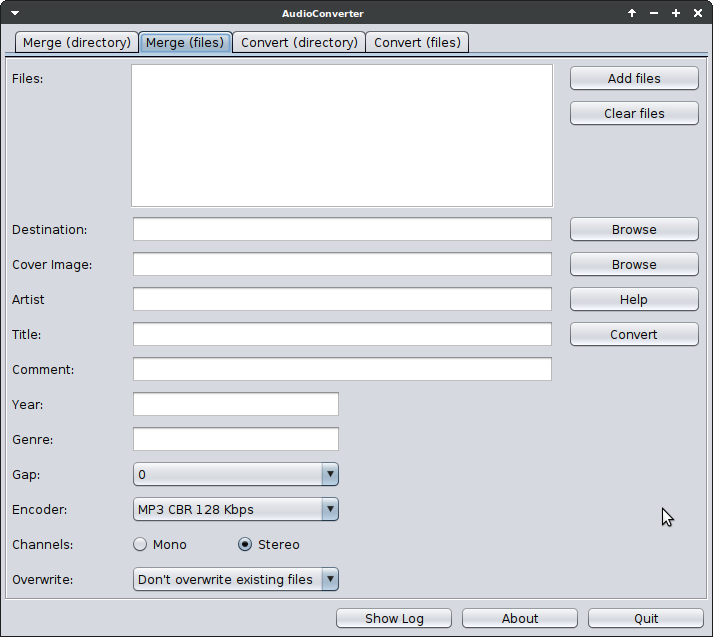
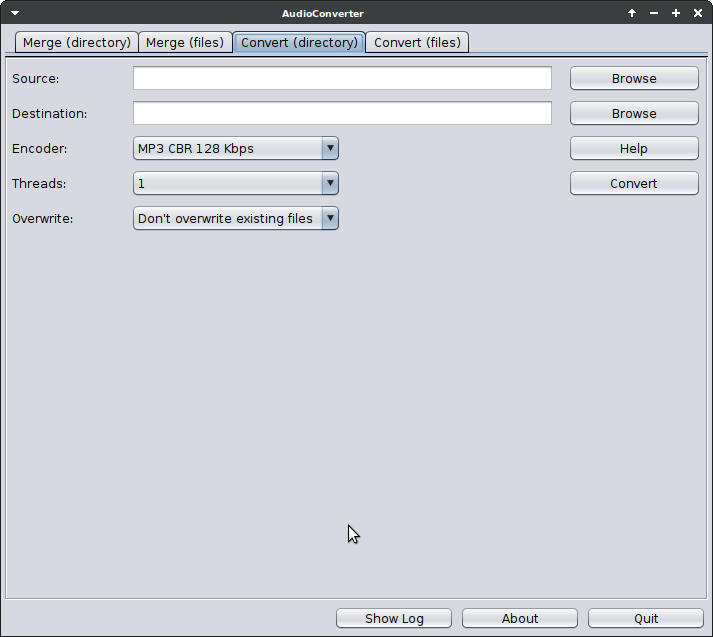
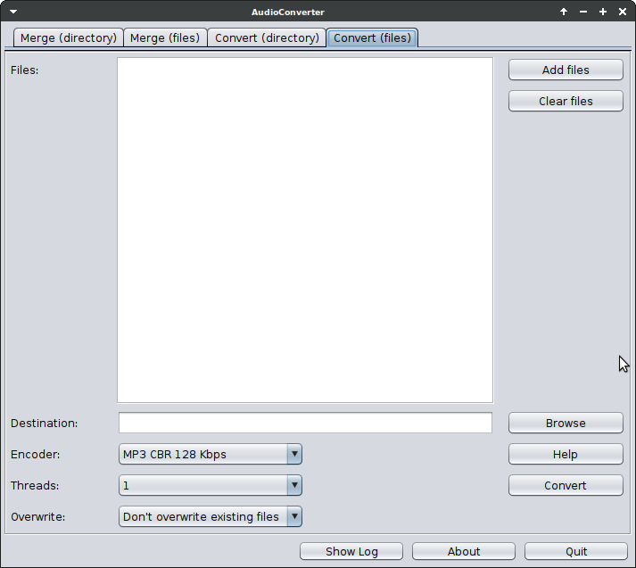

# AudioConverter

## About
AudioConverter converts audio and video files of different formats.  
It uses lame/oggenc/qaac64/faac/flac to encode the files.  
And ffmpeg for decoding.  
AudioConverter is  written in [kotlin](https://kotlinlang.org) and released under the [GNU General Public License v3.0](LICENSE).  

## Merge a directory of files
Convert a directory of files to a single file.  
All input files must have the same samplerate and number of channels (stereo/mono) and bitwidth.  
Tags can be set manually or copied from the first input file.  
Can run automatically from command line.  

## Merge a selection of files to a single file
Convert selected files to a single file.  
All input files must have the same samplerate and number of channels (stereo/mono) and bitwidth.  
Tags can be set manually or copied from the first input file.  

## Convert a directory tree of files
Convert all files in a directory tree.  
Tags will be copied from source to destination.  
Can use up to 128 threads.  
Can run automatically from command line.  

## Convert a selection of files
Convert all selected files.  
Tags will be copied from source to destination.  
Can use up to 128 threads.  

## Download
Download AudioConverter from [here](https://github.com/gnuwimp/AudioConverter/releases).  
Install [Java](https://java.com).  
Install [ffmpeg](https://www.ffmpeg.org) to decode flac/wav/ogg/m4a/avi/mp4/mkv files.  
Install [Lame](https://lame.sourceforge.io) to encode mp3 files.  
Install [oggenc](https://www.xiph.org/ogg) to encode ogg files.  
Install [qaac64](https://github.com/nu774/qaac/releases) to encode aac files (Windows + iTunes are needed).  
Install [faac](https://github.com/knik0/faac) to encode aac files (lower quality than qaac64/iTunes).  
Install [flac](https://github.com/xiph/flac) to encode flac files.  

It is possible to use qaac64.exe in linux if wine is installed.  
Copy qaac64.exe + needed dlls from iTunes to ~/.wine/drive_c/windows (hardcoded in AudioConverter).  

**Qaac64** version 2.84 does **NOT** work due to changes how it reads data. Use version 2.83.  

## Usage
Double-click AudioConverter.jar file on windows to start the program.  
Or run it from the command line with <code>java -jar AudioConverter.jar</code>.  
AudioConverter has been tested on Windows 10 and Ubuntu 24.10.  

## Screenshots
 

## Command Line Arguments  
To merge a directory of files from the command line use these arguments.  
Use "" around text and paths with spaces.  
<pre>
--src  [PATH]              source directory with audio files
--dest [PATH]              destination directory for target file
--artist [TEXT]            artist name
--title [TEXT]             album and title name
--comment [TEXT]           comment string (optional)
--cover [PATH]             track cover image (optional)
--year [YYYY]              track year (optional, 1 - 9999)
--genre [TEXT]             genre string (optional, default Audiobook)
--gap [SECONDS]            insert silence between tracks (optional, default 0)
                             valid values are: 0 - 5
--mono                     downmix stereo to mono (optional)
--overwrite [VALUE]        overwrite destination files (optional, default 0)
                             valid values are: 0 dont overwrite, 1 overwrite older, 3 overwrite all
--encoder [INDEX]          index in encoder list (optional, default 4 -> MP3 CBR 128 Kbps)
                             0 = MP3 CBR 32 Kbps
                             1 = MP3 CBR 48 Kbps
                             2 = MP3 CBR 64 Kbps
                             3 = MP3 CBR 96 Kbps
                             4 = MP3 CBR 128 Kbps
                             5 = MP3 CBR 192 Kbps
                             6 = MP3 CBR 256 Kbps
                             7 = MP3 CBR 320 Kbps
                             8 = MP3 VBR ~160 Kbps
                             9 = MP3 VBR ~190 Kbps
                             10 = MP3 VBR ~240 Kbps
                             11 = Ogg ~45 Kbps
                             12 = Ogg ~64 Kbps
                             13 = Ogg ~96 Kbps
                             14 = Ogg ~128 Kbps
                             15 = Ogg ~192 Kbps
                             16 = Ogg ~256 Kbps
                             17 = Ogg ~320 Kbps
                             18 = Ogg ~500 Kbps
                             19 = Q-AAC HE/CBR 48 Kbps
                             20 = Q-AAC HE/CBR 80 Kbps
                             21 = Q-AAC CVBR ~96 Kbps
                             22 = Q-AAC TVBR63 ~128 Kbps
                             23 = Q-AAC TVBR91 ~192 Kbps
                             24 = Q-AAC TVBR109 ~256 Kbps
                             25 = Q-AAC TVBR127 ~320 Kbps
                             26 = Q-AAC ALAC
                             27 = F-AAC ABR ~64 Kbps
                             28 = F-AAC ABR ~128 Kbps
                             29 = F-AAC ABR ~192 Kbps
                             30 = F-AAC ABR ~256 Kbps
                             31 = F-AAC ABR ~320 Kbps
                             32 = FLAC
--auto                     start automatically and quit after successful encoding (optional)
--auto2                    start automatically and quit even for error (optional)
</pre>

To convert directories from the command line use these arguments:
<pre>
--mode2                    set this mode
--src [PATH]               start directory with audio files
--dest [PATH]              destination directory for target file
--threads [COUNT]          set number of threads to use (optional, default 1)
                             valid values are: 1, 2, 3, 4, 5, 6, 7, 8, 12, 16, 24, 32, 48, 64, 96, 128
--overwrite [VALUE]        overwrite destination files (optional, default 0)
                             valid values are: 0 dont overwrite, 1 overwrite older, 3 overwrite all
--encoder [INDEX]          same options as above
--auto                     start automatically and quit after successful encoding (optional)
--auto2                    start automatically and quit even for error (optional)
</pre>

## Changes
<pre>
3.01:   Bug fixes and improvements.

3.0:    Added conversion for a selection of files.
        Added faac encoder.
        Added flac encoder.
        Possible to use qaac64 in linux (version 2.83).
        Bug fixes and improvements.

2.6.1:  Minor bug fixes and improvements.

2.6:    Added overwrite destination files option.
        Some bug fixes and improvements.

2.5:    Added aac encoding (Windows only, requires iTunes + qaac64).
        Minor improvements.
        Updated Jaudiotagger library and added it to the source tree.

2.4:    Renamed again from toMP3 to AudioConverter.
        Added support for file to file conversion.
        UI changes.
        Bug fixes.

2.3:    Added jaudiotagger for tag writing.
        Added support for ogg encoding.
        UI changes.
        Bitrate selection changed.

2.2:    Renamed from gabc to toMP3.
        Added support for more input files (m4a/flac/ogg/wav/avi/mkv/mp4).
        Options for mono/stereo and vbr.
        Insert silence between tracks.
        Bug fixes.

2.1:    Bug fixes.
</pre>
